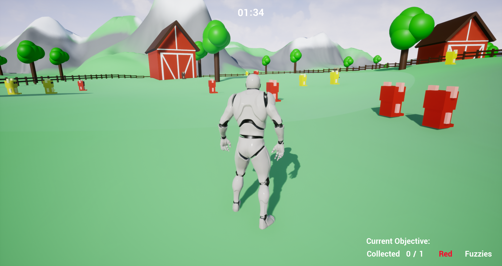
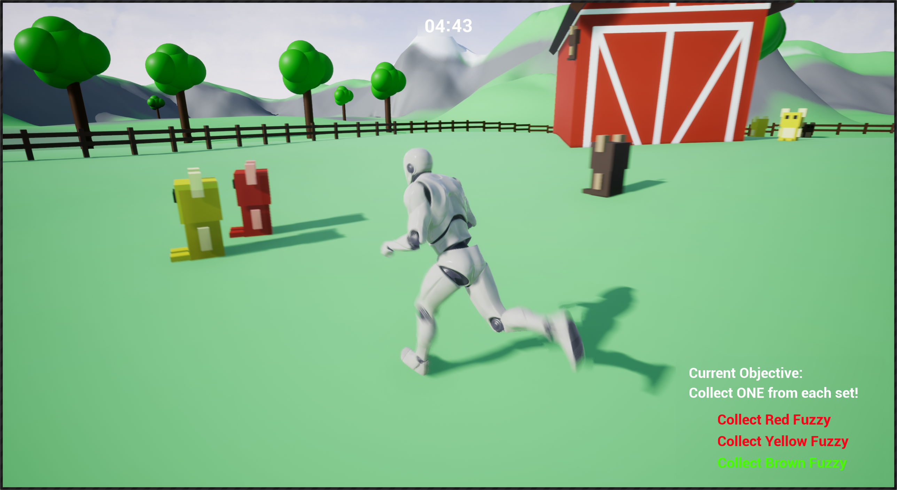
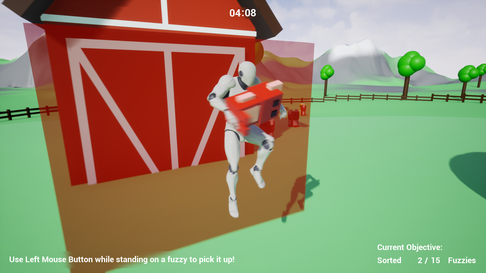
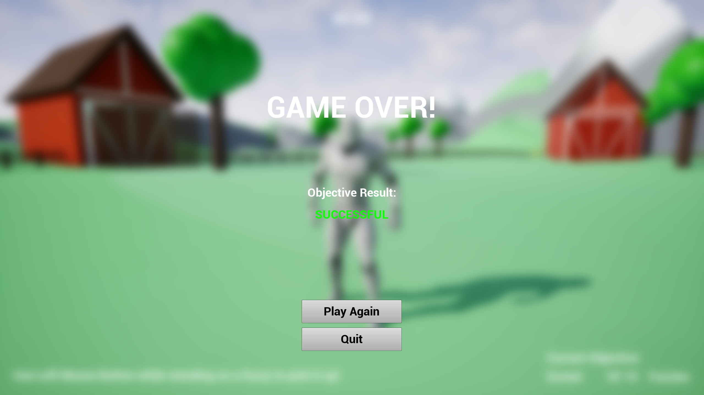
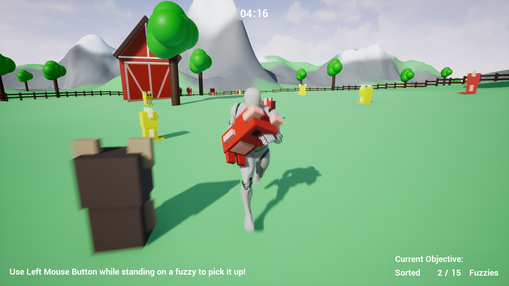

 

   

 

<h2>🗒️ Project Description</h2>

 

As the player, your goal in the game is to explore the map and locate/collect the randomly generated required stuffed animals, called fuzzies, within the time limit. These stuffed animals will be randomly placed around the map at the start of each round.

There are two game modes available! The first one, collect, requires you to collect specified fuzzies within the time limit. The second game mode, sort, requires you to pick up a fuzzy and return it to its corresponding barn, based on color.

https://www.youtube.com/watch?v=QFDmlsevEIg

https://www.youtube.com/watch?v=Td_oSbTSQo4

 

  
  

  
  

  

 

<h2>🛠️ Tools Used</h2>

 

 [Unreal Engine 4] - Primary Game Engine

 [Git] - Source Control

 

 

  
  

  
  

  
  

  
  

  

 

<h2>🧠 Project Reflection</h2>

- **How would you describe the process of creating and polishing the artifact?**
  
Overall, I would describe the process of creating and polishing this artifact as a fantastic learning and tinkering experience! Not only was this one of the first projects that I worked on for game development in university, but it was also one of the first times I had used Unreal Engine 4. Taking this into account, there was a lot that I had to learn about the interface, the blueprint system, terrain creation, and gameplay design within the project. As I iterated on this prototype, I quickly became much more comfortable with the advanced toolset that Unreal Engine 4 provides for creating fantastic projects. I feel that the progression of a lot of these skills, as well as rapid prototyping and iteration skills, are properly represented in this project, even if it has some areas that are rough around the edges due to its age.
  
- **What did you learn as you were creating it and improving it?**

As mentioned previously, I feel that the most prominent skills that I was able to build and strengthen throughout development of this prototype involved Unreal Engine's blueprint system. Learning about this way of creating logic, along with trying to transfer my prior knowledge of object-oriented programming languages (before moving on to using C++) was a fantastic experience. This project also allowed me to utilize rapid prototyping in order to efficiently and effectively conceptualize, develop, and test different gameplay mechanics without having to fully commit to a fully polished result, minimizing the potential lost time due to a bad translation of gameplay from concept to integration. During the improvement phase, I was also able to build skills for planning ahead during development, in order to easily add new features and gameplay in the future without having to re-design aspects of the existing project, also helping to greatly increase the efficiency of my development.

- **What challenges did you face?**

I believe that one of the largest challenges I faced throughout this project was the utilization of unfamiliar tools within an, at the time, mostly unfamiliar environment. There are a lot of challenges that go along with this aspect of a project, but I feel that I was able to successfully translate the skills and knowledge that I had gained from other platforms and projects into this one, eventually being able to take full advantage of the game engine for development of this prototype!

- **How did you incorporate feedback as you made changes to the artifact?**

Because this project was primarily focused on the rapid iteration and prototyping of gameplay elements, incorporating feedback as I made changes to the artifact was relatively efficient and straightforward. Rapid prototyping allowed me to quickly make necessary changes in order to increase the overall user experience and quality of the gameplay.

- **How was the artifact improved?**

The primary way in which this artifact was improved was through the implementation of a completely new game mode, sort mode, along with organization of the underlying blueprints driving the gameplay. This shows the implementation of completely modular systems that successfully facilitate the rapid implementation of new gameplay systems throughout the prototype. Along with this, the prioritization of organization and comments will allow additional developers to quickly understand the logic behind the existing gameplay systems so that they can easily begin to incorporate new gameplay functionality into the prototype, even as it evolves into a fully polished artifact.

 

 

  

